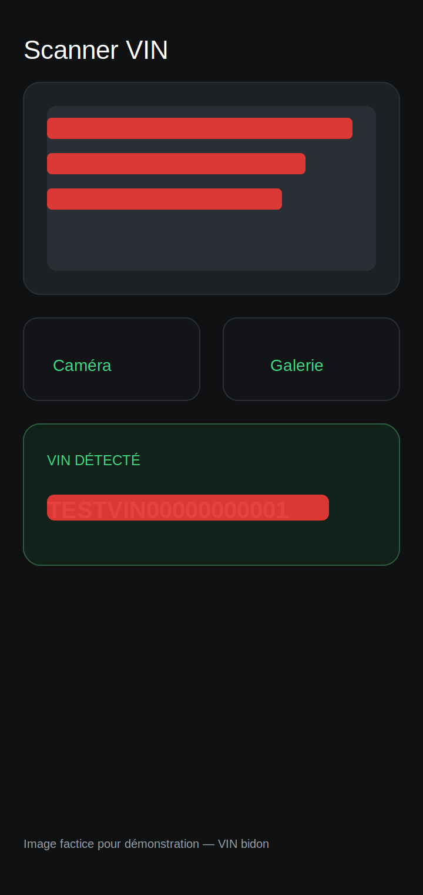

# Extraction de texte OCR

Petite application Flutter qui extrait le texte contenu dans une image.

## Installation
 
```bash
git clone https://github.com/sable12/une-demo-de-image-picker-utilisant-google-ml-kit.git
cd une-demo-de-image-picker-utilisant-google-ml-kit
flutter pub get
flutter run
```
 
## Utilisation

1. Ouvrez l'app.
2. Choisissez une image, soit en prenant une photo (**Caméra**), soit en en sélectionnant une déjà existante (**Galerie**).
3. Le texte détecté dans l'image s'affiche automatiquement en dessous.
4. Appuyez sur l'icône de copie pour copier le texte dans le presse-papiers.

## Technologies utilisées

- **Flutter** — framework de l'application
- **image_picker** — sélection de l'image (caméra ou galerie)
- **google_mlkit_text_recognition** — moteur OCR, exécuté entièrement sur l'appareil (hors ligne, sans envoi de données vers un serveur)

## Structure du projet

```
lib/
  main.dart                  → point d'entrée de l'app
  screens/home_screen.dart   → interface utilisateur
  services/ocr_service.dart  → logique d'extraction de texte (OCR)
```

## Limites connues

- Précision correcte, mais moins efficace que l'OCR cloud d'Azure Computer Vision API. En contrepartie, l'inférence tourne en local : l'image n'est jamais envoyée à un serveur. La bibliothèque dépend cependant de Google Play Services, qui peut effectuer des appels réseau annexes (mise à jour du modèle, télémétrie) hors de mon contrôle — un modèle self-hosted avec ONNX Runtime éliminerait complètement cette dépendance, au prix d'une précision généralement inférieure à Azure.
- Fonctionne uniquement pour du texte en alphabet latin (script configuré dans `ocr_service.dart`).




## Remarque sur l'image de démonstration

- L'image présente dans ce dépôt est factice (`assets/demo_vin.svg`) et utilisée uniquement pour la démonstration.  
- Des tests d'extraction ont également été réalisés sur des images réelles lorsque possible.  
- L'apparence de l'application dans le dépôt ne correspond pas exactement à la photo ; la photo utilisée pour le développement était un portefeuille (exemple).  
- L'extraction du VIN à partir d'images test a donné des résultats positifs (VIN détecté avec la logique d'OCR locale).  

 
